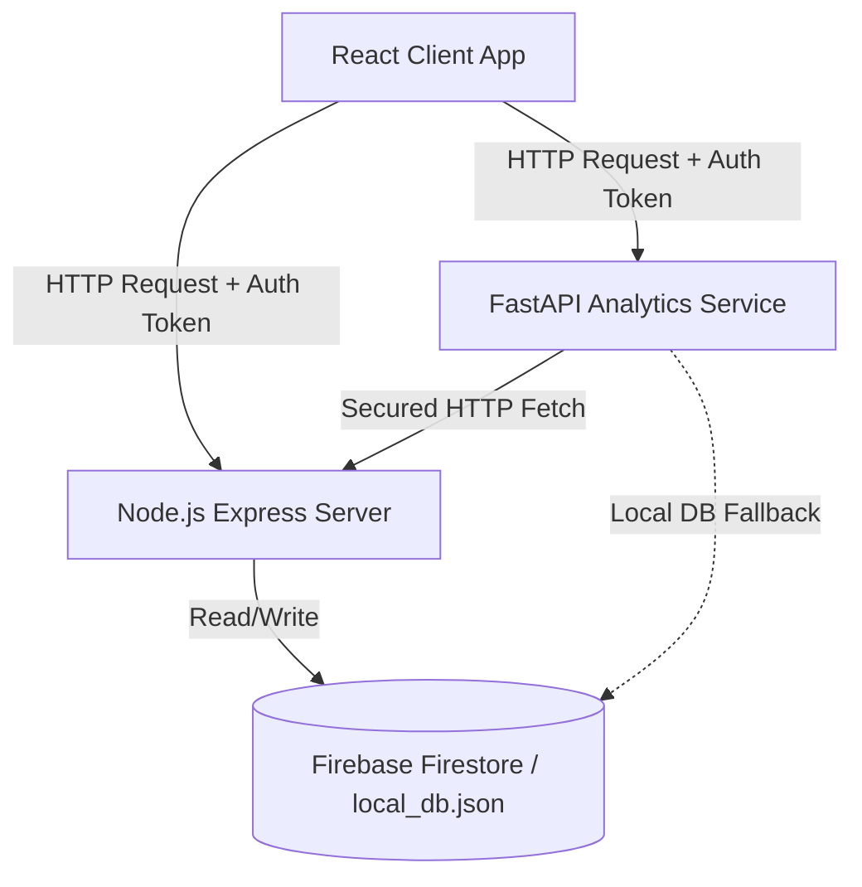

# Smart Address Book Management System with Data Analytics

> **Manage Contacts Intelligently. Discover Insights Instantly.**

A professional, production-ready, and highly performant full-stack CRM and Address Book Management System designed for modern portfolios. Built with a React.js client interface, Node.js + Express backend, and an independent Python FastAPI analytics service for data computations, reporting, and dashboard visualization.

---

## Architecture Diagram



---

## Features

1. **Complete English Translation & Rebranding**: Transformed legacy system labels, notifications, databases, and variables into clean, professional business-oriented English terminology.
2. **FastAPI Advanced Analytics Service**: A dedicated Python-based microservice that leverages Pandas and NumPy to compute:
   - **Overview Metrics**: Active, added today/week/month, densities, and contact counts.
   - **Category & Region Distribution**: Percentages, frequencies, most/least active segments.
   - **Growth & Trends**: Cumulative timeline and month-over-month additions rates.
   - **Data Quality Audit**: Composition percentages and field-level completeness scores.
   - **Duplicate Detection**: Smart risk report based on identical phone numbers or similar names.
3. **Responsive React Dashboard**: Multi-dimensional dashboard panels powered by **Chart.js** displaying:
   - Category Doughnut chart
   - Village Distribution Bar chart
   - Line & Area Growth Trends charts
   - Radial completeness gauge
4. **Data Portability**: Real-time export of structured details into `.csv` and Excel formats.
5. **Secure Middleware Integration**: Authorization headers forwarded from the client through FastAPI to Node.js backend endpoints, validating user sessions securely.

---

## Technology Stack

- **Frontend**: React.js (Vite, CSS Modules, Tailwind CSS, Lucide icons, Chart.js, XLSX)
- **Backend Node.js API**: Express.js, JWT, bcryptjs, Firebase Admin SDK
- **Python Analytics Service**: FastAPI, Pandas, NumPy, openpyxl, ReportLab, httpx
- **Database**: Firebase Firestore / Local JSON DB fallback

---

## Folder Structure

```
Project/
├── client/                     # React Client Application
│   ├── public/                 # Static Assets & PWA manifests
│   └── src/
│       ├── components/         # Core UI widgets (Form, Report, Login, Settings)
│       ├── pages/              # Reusable Analytics Dashboard views
│       ├── services/           # Axios API services
│       └── main.jsx
│
├── server/                     # NodeJS Express Backend Server
│   ├── controllers/            # Controller logic (Auth, Contacts, Settings, Villages)
│   ├── middleware/             # Express middlewares (JWT protecting)
│   ├── models/                 # Database adapters (db.js, Firestore / local_db)
│   └── server.js
│
├── analytics-service/          # Python FastAPI Analytics Service
│   ├── analytics/              # Computation modules (quality, trends, segmentation)
│   ├── backups/                # Local data backup storage
│   ├── main.py                 # FastAPI application router and fallback methods
│   └── requirements.txt        # Python pip dependencies
│
└── README.md                   # Project Documentation
```

---

## Installation & Setup Guide

### 1. Prerequisites
Ensure you have Node.js (v18+) and Python (3.9+) installed.

### 2. Node.js Express Backend
1. Navigate to the `server/` directory:
   ```bash
   cd server
   ```
2. Install npm packages:
   ```bash
   npm install
   ```
3. Set up environment variables inside a `.env` file:
   ```env
   PORT=5000
   JWT_SECRET=your_jwt_secret_key_here
   ```
4. Run in development mode:
   ```bash
   npm run dev
   ```

### 3. Python FastAPI Analytics Service
1. Navigate to the `analytics-service/` directory:
   ```bash
   cd analytics-service
   ```
2. Create and activate a virtual environment:
   ```bash
   python -m venv venv
   source venv/bin/activate  # On Windows: venv\Scripts\activate
   ```
3. Install dependencies:
   ```bash
   pip install -r requirements.txt
   ```
4. Run the uvicorn development server:
   ```bash
   uvicorn main:app --reload --port 8000
   ```

### 4. React Client Application
1. Navigate to the `client/` directory:
   ```bash
   cd client
   ```
2. Install npm packages:
   ```bash
   npm install
   ```
3. Run the development build:
   ```bash
   npm run dev
   ```

---

## API Documentation

The FastAPI server exposes the following REST endpoints:

- **`GET /analytics/overview`**: Returns total/active contacts count, registration timeline windows, and village contact averages.
- **`GET /analytics/categories`**: Returns category distribution percentages, mode, and least common category metrics.
- **`GET /analytics/villages`**: Returns contacts grouped by village contribution percentage.
- **`GET /analytics/monthly-trends`**: Compiles month-over-month additions trends and cumulative counts.
- **`GET /analytics/recent-contacts`**: Lists the last 10 added records.
- **`GET /analytics/data-quality`**: Calculates field missing rates and composite database completeness score.
- **`GET /analytics/duplicates`**: Returns risk assessment list identifying duplicate phone or similar names clusters.
- **`GET /analytics/segments`**: Returns user segment combinations and insight remarks.
- **`GET /analytics/export/csv`**: Downloads complete contact list in `.csv` format.
- **`GET /analytics/export/excel`**: Downloads complete contact list in `.xlsx` format.

---

## Future Enhancements

- **Machine Learning Integration**: Introduce contact categorization classifiers and village location autocomplete matching algorithms.
- **Role-Based Access Control (RBAC)**: Support multiple admin tier levels.
- **Automated Email Reports**: Integrate cron triggers sending weekly PDF digests using SendGrid or Mailgun APIs.

---

## Author Section

Developed by a **Jay Bhuva**. Showcase this project for recruiter evaluations, presentations, and technical portfolios.
